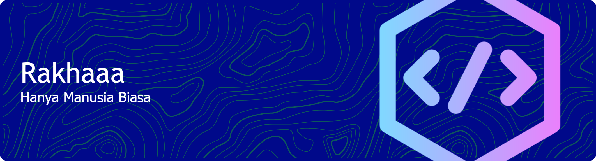

<div align="center">
  
<!-- HEADER BANNER -->


<!-- ANIMATED TYPING -->
<a href="https://git.io/typing-svg">
	
</a>

<!-- PROFILE VIEWS & FOLLOWERS -->
<p>
	
	<a href="https://github.com/Nurrakha?tab=followers">
		
	</a>
</p>

</div>

---

<!-- ⚡ LIGHTNING DIVIDER -->
<p align="center">
	
</p>

## ⚡ About Me

```yaml
name: Nurrakha
role: Electrical Engineering Student
location: Indonesia 🇮🇩
education: Electrical Engineering
interests: ["IoT", "Embedded Systems", "Web Development", "Electrical Systems"]

currently_working_on: IoT projects & web-based monitoring systems
currently_learning: ["IoT", "Laravel", "Embedded C++", "Python"]
fun_fact: "I combine hardware and software to build smart systems ⚡"

motto: "Wire it. Code it. Power it. ⚡"
```

<p align="center">
	
</p>

---

## 🛠️ Tech Stack & Tools

<div align="center">

<!-- LANGUAGES -->
<h3>⚡ Languages</h3>
<p>
	
	
	
	
	
</p>

<!-- FRAMEWORKS & IoT -->
<h3>⚡ Frameworks & IoT</h3>
<p>
	
	
	
	
	
	
</p>

<!-- TOOLS -->
<h3>⚡ Tools & Platforms</h3>
<p>
	
	
	
	
	
	
</p>

</div>

---

## 📊 GitHub Stats

<div align="center">

<!-- STATS CARDS -->
<p>
	<a href="https://github.com/Nurrakha">
		
	</a>
	<a href="https://github.com/Nurrakha">
		
	</a>
</p>

<!-- STREAK STATS -->
<p>
	<a href="https://github.com/Nurrakha">
		
	</a>
</p>

<!-- ACTIVITY GRAPH -->
<p>
	<a href="https://github.com/Nurrakha">
		
	</a>
</p>

</div>

---

## 🏆 GitHub Trophies

<div align="center">
	
</div>

---

## 🐍 Contribution Snake

<div align="center">
	<picture>
		<source media="(prefers-color-scheme: dark)" srcset="https://raw.githubusercontent.com/Nurrakha/Nurrakha/output/github-snake-dark.svg" />
		<source media="(prefers-color-scheme: light)" srcset="https://raw.githubusercontent.com/Nurrakha/Nurrakha/output/github-snake.svg" />
		
	</picture>
</div>

---

## 📫 Connect With Me

<div align="center">
<p>
	<a href="mailto:nurrakhmansyarifudin1@gmail.com">
		
	</a>
	<a href="https://github.com/Nurrakha">
		
	</a>
	<a href="https://www.instagram.com/nurrakha">
		
	</a>
	<a href="https://www.linkedin.com/in/nurrakha">
		
	</a>
</p>
</div>

---

<div align="center">

<!-- FOOTER -->


<p>
	
</p>

</div>
